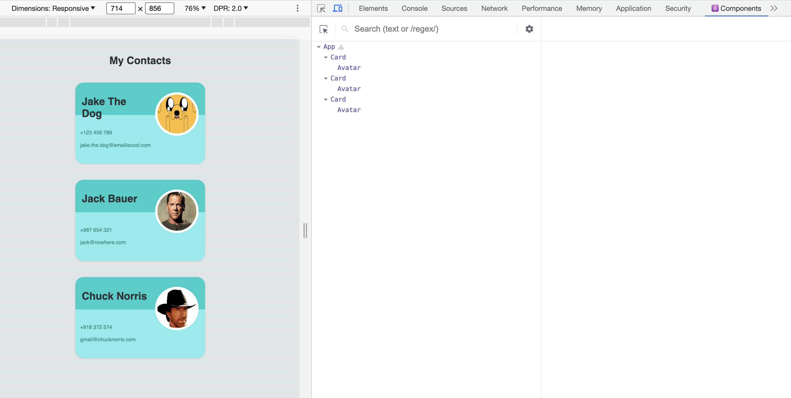
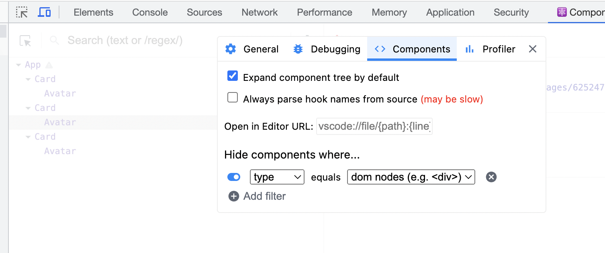
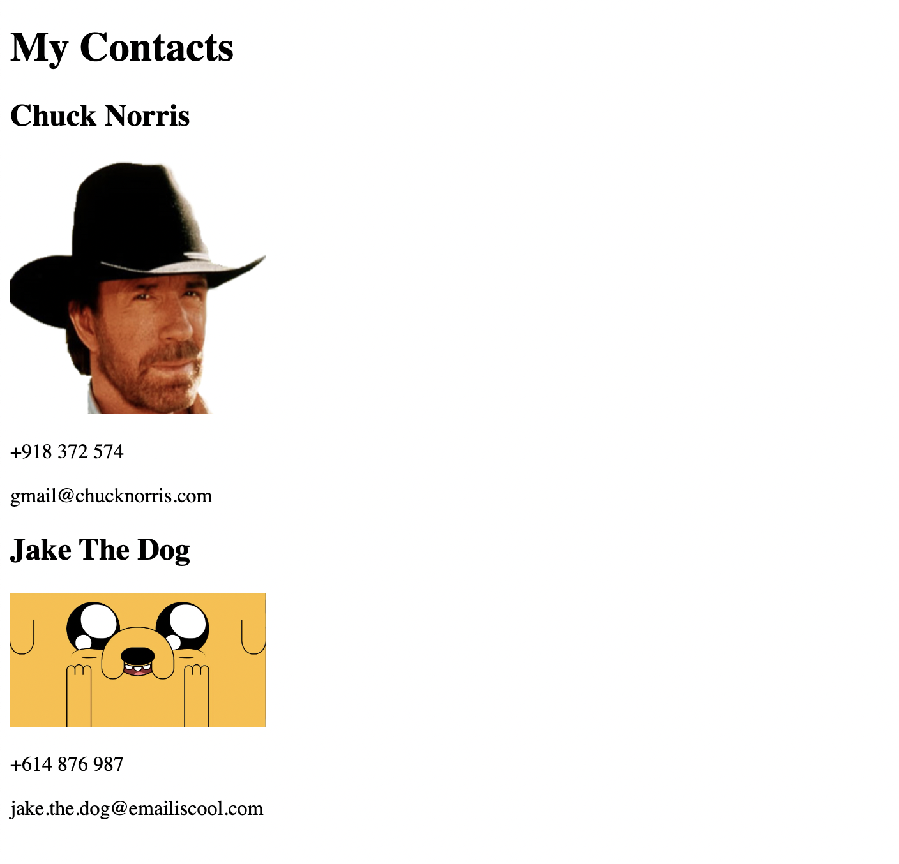
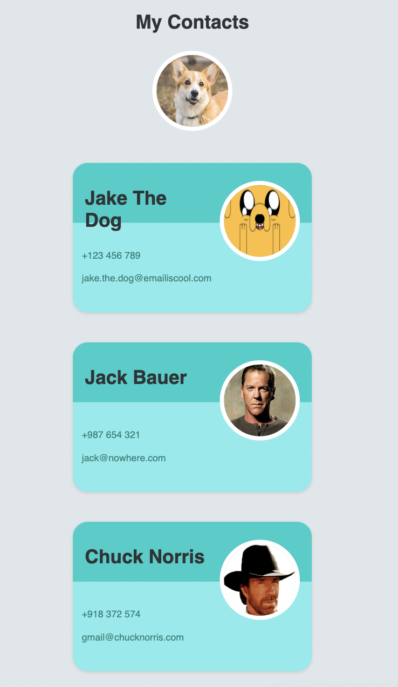

# Practice React Props

Course material from Udemy: https://entainaustralia.udemy.com/course/the-complete-web-development-bootcamp/learn/lecture/17039094#overview

## Getting Started

`npm install`

`npm start`

http://localhost:300

## Learning Objectives / Practice

1. Investigating/ Understanding what is in a props

console.log(props)

Returns an Object

- extracting components and making them smaller.

2. React DOM Tree

https://chrome.google.com/webstore/detail/react-developer-tools/fmkadmapgofadopljbjfkapdkoienihi

There is also a filter to show more of the HTML components

Can also show the source code and inspect it, inside your browser.

3. Mapping Data to Components

Passing a function within a function. 

The data requires a key, otherwise there is an error in the console

## Screenshots

## Resources

**MDN Attributes**

https://developer.mozilla.org/en-US/docs/Web/HTML/Attributes

https://react.dev/learn/passing-props-to-a-component
