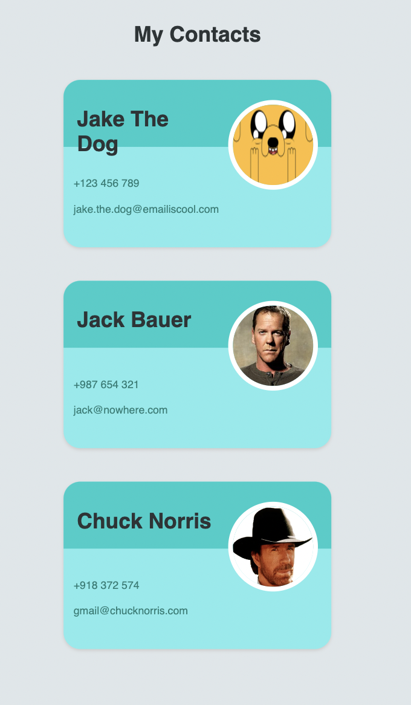

# Practice React Props

Course material from Udemy: https://entainaustralia.udemy.com/course/the-complete-web-development-bootcamp/learn/lecture/17039094#overview

## Getting Started

``npm install``

``npm start``

http://localhost:300 

## Learning Objectives / Practice

1. Investigating/ Understanding what is in a props

console.log(props)

Returns an Object

* extracting components and making them smaller.

2. React DOM Tree

## Screenshots

## Resources

**MDN Attributes**

https://developer.mozilla.org/en-US/docs/Web/HTML/Attributes

